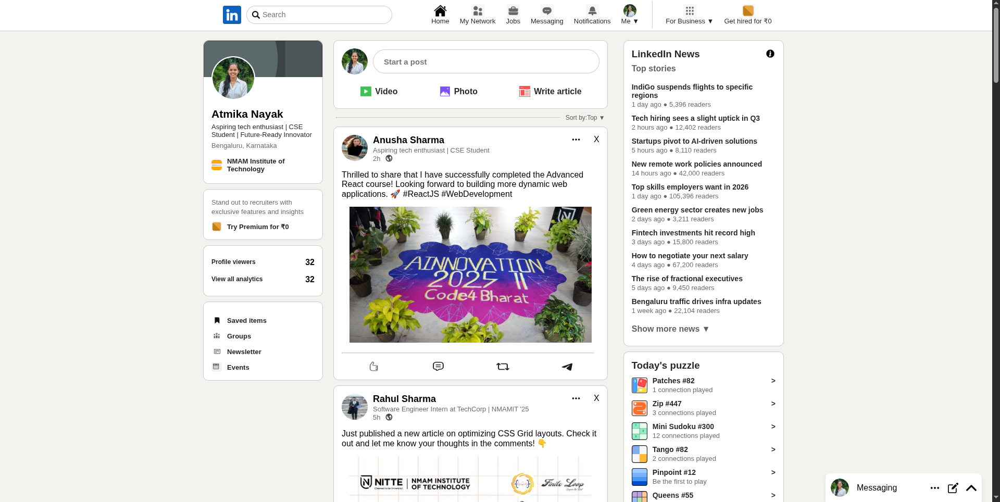
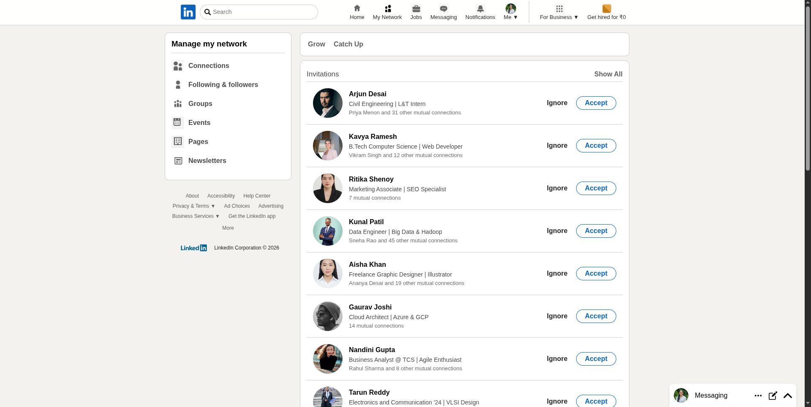
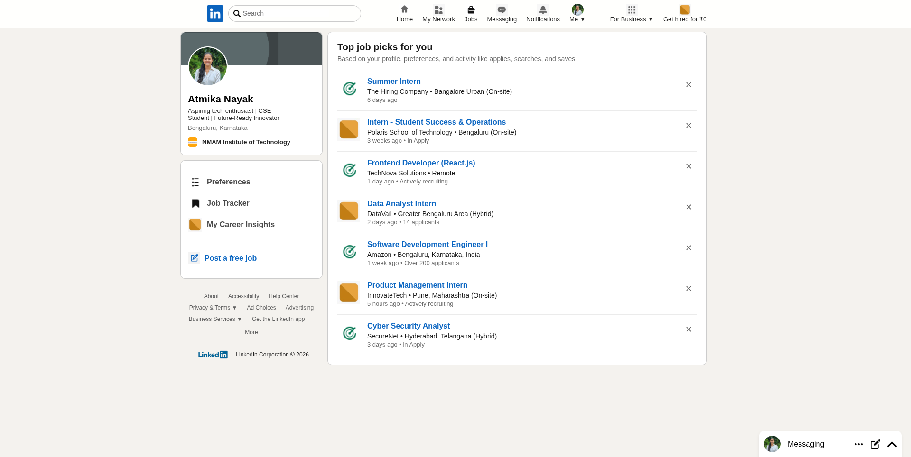

# LinkedIn Clone

A LinkedIn-inspired social networking interface built with React. The project recreates key sections of LinkedIn including the Home Feed, My Network, Jobs, Navigation Bar, Messaging Panel, News Section, Profile Card, and Connection Suggestions. The application uses reusable React components and React Router for page navigation.

## Features

* LinkedIn-style responsive user interface
* Home feed with posts and engagement actions
* Profile section with analytics and shortcuts
* My Network page with connection requests and suggestions
* Jobs page with personalized job recommendations
* LinkedIn News section
* Messaging panel
* React Router based navigation
* Reusable component architecture

---

## Tech Stack

### Frontend

* React
* JavaScript
* CSS
* React Router DOM

---

## Screenshots

### Home Feed



### My Network



### Jobs



---

## Project Structure

```text
linkedin/
├── public/
├── src/
│   ├── assets/
│   ├── App.js
│   ├── Navbar.js
│   ├── Home.js
│   ├── Network.js
│   ├── Job.js
│   ├── Left.js
│   ├── Center.js
│   ├── Right.js
│   ├── Profile.js
│   ├── Messages.js
│   ├── HomeCards.js
│   ├── NetworkCard.js
│   ├── JobCards.js
│   ├── RequestContent.js
│   ├── Footer.js
│   └── ...
├── package.json
└── README.md
```

---

## Pages

### Home

* User profile card
* Feed creation panel
* News section
* Feed posts with engagement actions

### My Network

* Connection requests
* Network management shortcuts
* Suggested connections
* LinkedIn games and puzzles

### Jobs

* Job recommendations
* Career insights
* Job tracker section

---

## Application Workflow

1. User lands on the Home page.
2. Navigation bar allows switching between Home, My Network, and Jobs.
3. Home page displays posts, profile information, and news.
4. My Network page displays invitations and suggested connections.
5. Jobs page displays recommended job opportunities.
6. Messaging panel remains accessible across pages.

---

## Installation

```bash
git clone <repository-url>

cd linkedin

npm install

npm start
```

Open:

```text
http://localhost:3000
```

---

## Author

### Atmika Nayak

GitHub: https://github.com/AtmikaNayak
