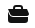

# LinkedIn UI Clone

A LinkedIn-inspired user interface built with React. The project recreates major sections of LinkedIn including the Home Feed, Network, Jobs, Profile, Messaging, News, and Navigation components using reusable React components.

## Features

- LinkedIn-style responsive layout
- Home feed interface
- My Network section
- Jobs page
- Messaging panel
- News sidebar
- Profile section
- Component-based architecture

## Tech Stack

- React
- JavaScript
- CSS
- React Router

## Project Structure

```text
linkedin/
├── public/
├── src/
│   ├── assets/
│   ├── components
│   └── pages
├── package.json
└── README.md
```

## Running Locally

```bash
git clone <repository-url>

cd linkedin

npm install

npm start
```

Open:

```text
http://localhost:3000
```

## Running Tests

```bash
npm test
```

## Integration Notes

This project is purely frontend and can be connected to APIs for authentication, posts, networking, messaging, and job recommendations.

## Visuals

### Home Feed


### Network


### Jobs



## Additional Resources

- React Documentation: https://react.dev/
